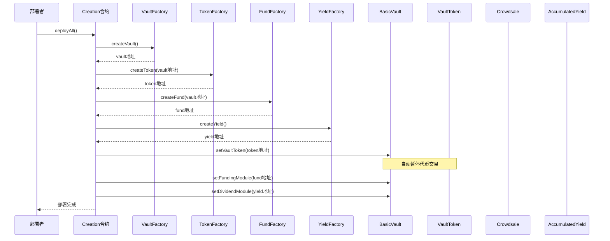
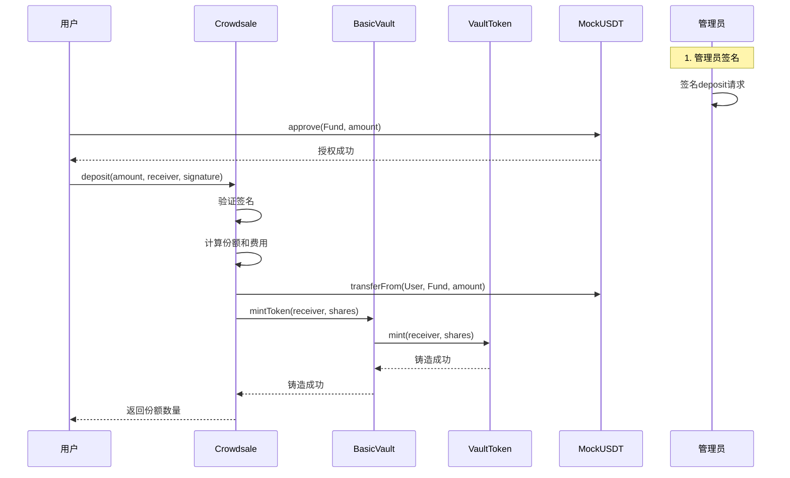
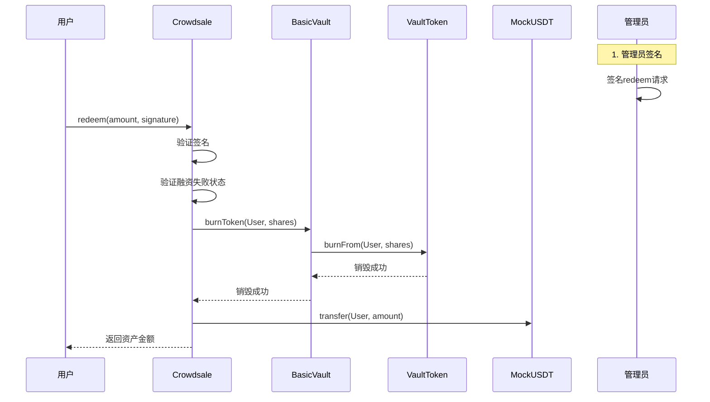
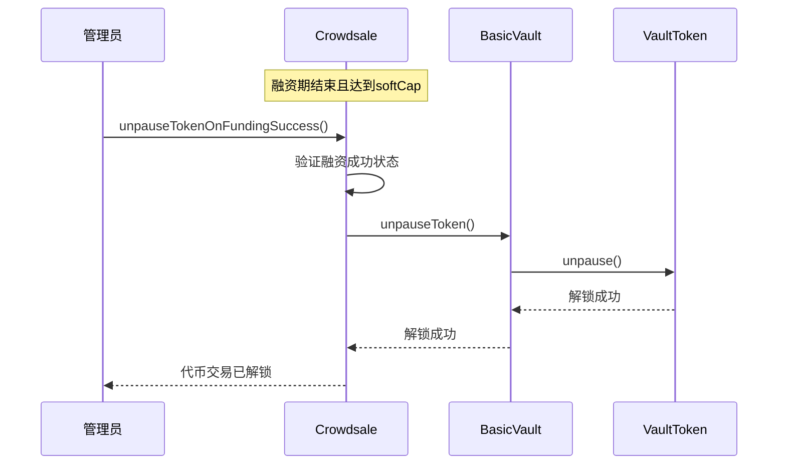
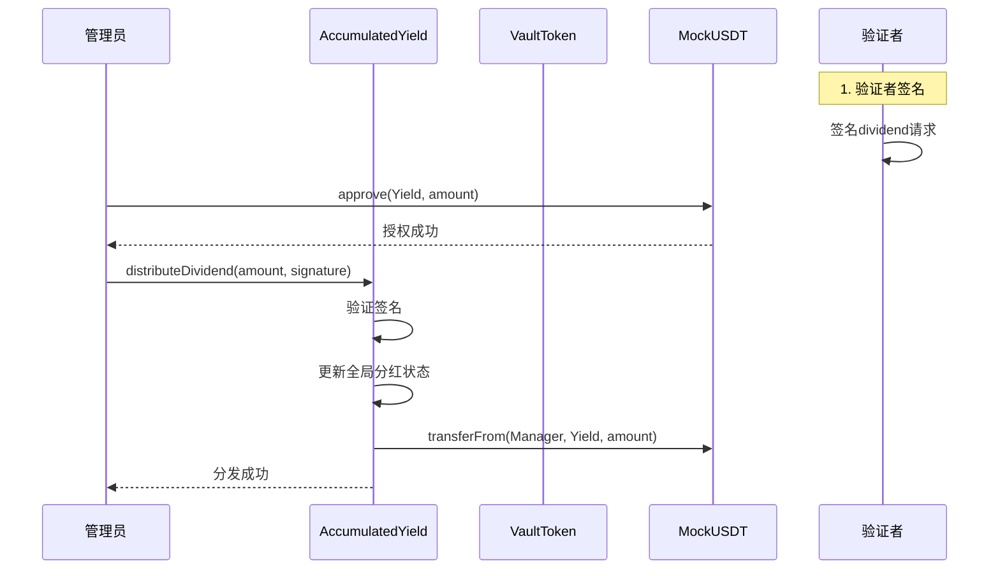
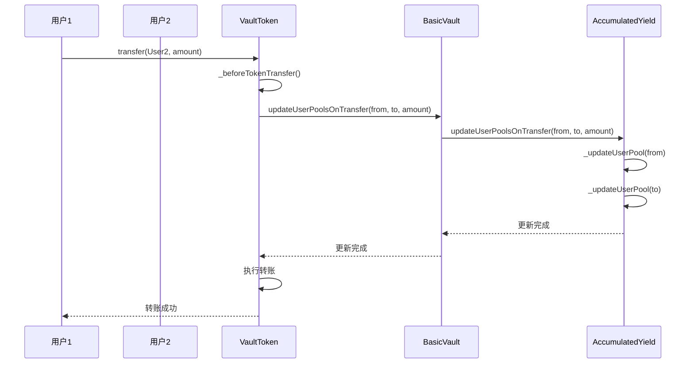
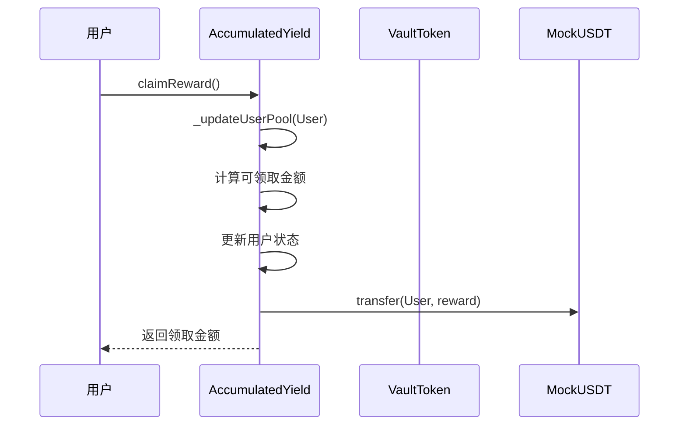

# V2 架构完整测试流程文档

## 目录
1. [测试架构概述](#1-测试架构概述)
2. [业务流程时序图](#2-业务流程时序图)
3. [测试用例设计](#3-测试用例设计)
4. [测试数据配置](#4-测试数据配置)
5. [测试执行策略](#5-测试执行策略)
6. [预期结果验证](#6-预期结果验证)

## 1. 测试架构概述

### 1.1 测试目标
验证 V2 架构的完整业务流程，确保从合约部署到具体业务场景的每个环节都能正确工作。

### 1.2 核心组件
- **Creation**: 一键部署合约，负责创建完整的项目架构
- **BasicVault**: 金库管理，处理权限控制和模块协调
- **VaultToken**: 份额代币，支持转账和分红计算
- **Crowdsale**: 融资模块，处理 deposit 和 redeem 操作
- **AccumulatedYield**: 分红模块，管理分红分发和领取
- **MockUSDT**: 测试资产代币，模拟真实资产

### 1.3 测试覆盖范围
- ✅ 合约部署和初始化
- ✅ 融资阶段操作（deposit）
- ✅ 融资失败场景（redeem）
- ✅ 融资成功场景（dividend、claim）
- ✅ 代币流转操作（transfer）
- ✅ 权限控制和错误处理

## 2. 业务流程时序图

### 2.1 项目部署流程



### 2.2 Deposit 操作流程



### 2.3 Redeem 操作流程（融资失败）



### 2.4 融资成功解锁流程



### 2.5 Dividend 分发流程



### 2.6 Transfer 触发分红更新流程



### 2.7 Claim 领取分红流程



## 3. 测试用例设计

### 3.1 基础设置测试

#### 3.1.1 合约部署测试
```javascript
describe("合约部署测试", function () {
    it("应该成功部署完整的V2架构", async function () {
        // 验证所有合约成功部署
        expect(await vault.vaultToken()).to.equal(token.address);
        expect(await vault.funding()).to.equal(fund.address);
        expect(await vault.accumulatedYield()).to.equal(yield.address);
    });
});
```

#### 3.1.2 初始化状态测试
```javascript
describe("初始化状态测试", function () {
    it("应该正确设置初始参数", async function () {
        // 验证融资参数
        expect(await fund.maxSupply()).to.equal(MAX_SUPPLY);
        expect(await fund.softCap()).to.equal(SOFT_CAP);
        expect(await fund.manageFeeBps()).to.equal(MANAGE_FEE_BPS);
        
        // 验证权限设置
        expect(await fund.manager()).to.equal(manager.address);
        expect(await vault.manager()).to.equal(manager.address);
    });
});
```

### 3.2 Deposit 操作测试

#### 3.2.1 正常 Deposit 测试
```javascript
describe("正常Deposit测试", function () {
    it("应该成功处理正常deposit", async function () {
        const depositAmount = ethers.parseUnits("1000", 6);
        const signature = await prepareDepositSignature(user1, depositAmount, user1.address);
        
        await usdt.connect(user1).approve(fund.address, depositAmount);
        const tx = await fund.connect(user1).deposit(depositAmount, user1.address, signature);
        
        // 验证份额计算
        const expectedShares = calculateExpectedShares(depositAmount);
        expect(await token.balanceOf(user1.address)).to.equal(expectedShares);
        
        // 验证费用扣除
        const expectedFee = (depositAmount * MANAGE_FEE_BPS) / 10000;
        expect(await fund.manageFee()).to.equal(expectedFee);
    });
});
```

#### 3.2.2 部分 Deposit 测试
```javascript
describe("部分Deposit测试", function () {
    it("应该正确处理供应量不足的情况", async function () {
        // 先进行大额deposit
        const largeAmount = ethers.parseUnits("999999", 6);
        await performLargeDeposit(largeAmount);
        
        // 尝试deposit剩余金额
        const remainingAmount = ethers.parseUnits("1000", 6);
        const signature = await prepareDepositSignature(user2, remainingAmount, user2.address);
        
        await usdt.connect(user2).approve(fund.address, remainingAmount);
        const tx = await fund.connect(user2).deposit(remainingAmount, user2.address, signature);
        
        // 验证只获得剩余份额
        expect(await token.balanceOf(user2.address)).to.be.lt(calculateExpectedShares(remainingAmount));
    });
});
```

### 3.3 融资成功解锁测试

#### 3.3.1 融资成功解锁测试
```javascript
describe("融资成功解锁测试", function () {
    it("应该在融资成功后解锁代币交易", async function () {
        // 先进行足够的deposit达到softCap
        await performLargeDeposit(SOFT_CAP_AMOUNT);
        
        // 等待融资期结束
        await time.increase(FUNDING_DURATION + 1);
        
        // 验证融资成功
        expect(await fund.isFundingSuccessful()).to.be.true;
        
        // 解锁代币交易
        const tx = await fund.connect(manager).unpauseTokenOnFundingSuccess();
        
        // 验证代币已解锁
        expect(await token.paused()).to.be.false;
        
        // 验证可以正常转账
        const transferAmount = ethers.parseUnits("100", 18);
        await token.connect(user1).transfer(user2.address, transferAmount);
        expect(await token.balanceOf(user2.address)).to.equal(transferAmount);
    });
});
```

### 3.4 Redeem 操作测试

#### 3.4.1 融资失败 Redeem 测试
```javascript
describe("融资失败Redeem测试", function () {
    it("应该成功处理融资失败后的redeem", async function () {
        // 模拟融资失败
        await time.increase(FUNDING_DURATION + 1);
        await fund.connect(manager).finalizeFunding();
        
        const userBalance = await token.balanceOf(user1.address);
        const signature = await prepareRedeemSignature(user1, userBalance);
        
        const tx = await fund.connect(user1).redeem(userBalance, signature);
        
        // 验证资产返还
        const expectedReturn = calculateRedeemAmount(userBalance);
        expect(await usdt.balanceOf(user1.address)).to.equal(expectedReturn);
    });
});
```

### 3.5 Dividend 操作测试

#### 3.5.1 分红分发测试
```javascript
describe("分红分发测试", function () {
    it("应该成功分发分红", async function () {
        const dividendAmount = ethers.parseUnits("10000", 6);
        const signature = await prepareDividendSignature(dividendAmount);
        
        await usdt.connect(manager).approve(yield.address, dividendAmount);
        const tx = await yield.connect(manager).distributeDividend(dividendAmount, signature);
        
        // 验证分红状态
        expect(await yield.totalDividend()).to.equal(dividendAmount);
        expect(await yield.totalAccumulatedShares()).to.be.gt(0);
    });
});
```

#### 3.5.2 转账触发分红更新测试
```javascript
describe("转账触发分红更新测试", function () {
    it("应该正确处理转账触发的分红更新", async function () {
        // 先分发分红
        await distributeDividend();
        
        // 执行转账
        const transferAmount = ethers.parseUnits("100", 18);
        await token.connect(user1).transfer(user2.address, transferAmount);
        
        // 验证用户状态更新
        const user1Info = await yield.getUserInfo(user1.address);
        const user2Info = await yield.getUserInfo(user2.address);
        
        expect(user1Info.accumulatedShares).to.be.gt(0);
        expect(user2Info.accumulatedShares).to.equal(0); // 转账后才持有代币
    });
});
```

### 3.6 Claim 操作测试

#### 3.6.1 分红领取测试
```javascript
describe("分红领取测试", function () {
    it("应该成功领取分红", async function () {
        // 分发分红
        await distributeDividend();
        
        // 领取分红
        const initialBalance = await usdt.balanceOf(user1.address);
        const tx = await yield.connect(user1).claimReward();
        
        // 验证领取结果
        const finalBalance = await usdt.balanceOf(user1.address);
        expect(finalBalance).to.be.gt(initialBalance);
        
        // 验证用户状态更新
        const userInfo = await yield.getUserInfo(user1.address);
        expect(userInfo.lastClaimTime).to.be.gt(0);
    });
});
```

### 3.7 复杂场景测试

#### 3.7.1 完整业务流程测试
```javascript
describe("完整业务流程测试", function () {
    it("应该正确处理完整的业务流程", async function () {
        // 1. 用户1 deposit
        await performDeposit(user1, ethers.parseUnits("1000", 6));
        
        // 2. 等待融资成功并解锁代币交易
        await performLargeDeposit(SOFT_CAP_AMOUNT);
        await time.increase(FUNDING_DURATION + 1);
        await fund.connect(manager).unpauseTokenOnFundingSuccess();
        
        // 3. 用户1 转账给用户2
        const transferAmount = ethers.parseUnits("100", 18);
        await token.connect(user1).transfer(user2.address, transferAmount);
        
        // 4. 分发分红
        await distributeDividend();
        
        // 5. 用户2 转账给用户3
        await token.connect(user2).transfer(user3.address, transferAmount);
        
        // 6. 用户1 和用户3 领取分红
        await yield.connect(user1).claimReward();
        await yield.connect(user3).claimReward();
        
        // 7. 验证最终状态
        await verifyFinalState();
    });
});
```

## 4. 测试数据配置

### 4.1 基础配置常量
```javascript
const TEST_CONFIG = {
    // 时间配置
    FUNDING_DURATION: 3600, // 1小时
    START_TIME_OFFSET: 300, // 5分钟后开始
    
    // 金额配置
    MAX_SUPPLY: ethers.parseUnits("1000000", 18),
    SOFT_CAP: ethers.parseUnits("100000", 18),
    SOFT_CAP_AMOUNT: ethers.parseUnits("110000", 6), // 确保达到softCap的金额
    SHARE_PRICE: ethers.parseUnits("1", 18),
    MIN_DEPOSIT: ethers.parseUnits("100", 18),
    
    // 费用配置
    MANAGE_FEE_BPS: 1000, // 10%
    
    // 测试用户配置
    USERS: {
        user1: { initialBalance: ethers.parseUnits("10000", 6) },
        user2: { initialBalance: ethers.parseUnits("10000", 6) },
        user3: { initialBalance: ethers.parseUnits("10000", 6) }
    }
};
```

### 4.2 工具函数
```javascript
// 签名工具函数
async function prepareDepositSignature(user, amount, receiver, nonce) {
    const messageHash = await fund.getDepositSignatureMessage(amount, receiver, nonce);
    return await manager.signMessage(ethers.getBytes(messageHash));
}

async function prepareRedeemSignature(user, amount, nonce) {
    const messageHash = await fund.getRedeemSignatureMessage(amount, nonce);
    return await manager.signMessage(ethers.getBytes(messageHash));
}

async function prepareDividendSignature(amount) {
    const messageHash = await yield.getDividendSignatureMessage(amount);
    return await validator.signMessage(ethers.getBytes(messageHash));
}

// 计算工具函数
function calculateExpectedShares(amount) {
    const feeAmount = (amount * MANAGE_FEE_BPS) / 10000;
    const netAmount = amount - feeAmount;
    return (netAmount * SHARE_PRICE) / (10 ** 18);
}

function calculateRedeemAmount(shares) {
    return (shares * SHARE_PRICE) / (10 ** 18);
}

// 业务流程工具函数
async function performLargeDeposit(amount) {
    const signature = await prepareDepositSignature(user1, amount, user1.address);
    await usdt.connect(user1).approve(fund.address, amount);
    return await fund.connect(user1).deposit(amount, user1.address, signature);
}

async function distributeDividend() {
    const dividendAmount = ethers.parseUnits("10000", 6);
    const signature = await prepareDividendSignature(dividendAmount);
    await usdt.connect(manager).approve(yield.address, dividendAmount);
    return await yield.connect(manager).distributeDividend(dividendAmount, signature);
}

async function verifyFinalState() {
    // 验证最终状态的逻辑
    expect(await token.paused()).to.be.false;
    expect(await fund.isFundingSuccessful()).to.be.true;
}
```

## 5. 测试执行策略

### 5.1 测试顺序
1. **基础功能测试**：确保各模块基本功能正常
2. **业务流程测试**：验证完整的业务逻辑
3. **边界条件测试**：测试异常情况处理
4. **性能测试**：验证大量操作的处理能力

### 5.2 测试隔离
- 每个测试用例使用独立的合约实例
- 使用 `beforeEach` 重置状态
- 避免测试间的相互影响

### 5.3 错误处理
- 验证正确的错误信息
- 测试权限控制
- 验证状态回滚

## 6. 预期结果验证

### 6.1 成功场景验证
- ✅ 所有合约部署成功
- ✅ 代币在设置时自动暂停
- ✅ 融资成功后正确解锁代币交易
- ✅ 业务流程执行正确
- ✅ 状态更新准确
- ✅ 代币转账成功
- ✅ 分红计算正确
- ✅ 权限控制有效

### 6.2 失败场景验证
- ✅ 权限验证正确
- ✅ 错误信息准确
- ✅ 状态回滚正确
- ✅ 资金安全保护
- ✅ 签名验证有效

### 6.3 性能指标
- 单次操作响应时间 < 5秒
- 批量操作处理能力 > 100次/分钟
- 内存使用稳定，无泄漏
- Gas 消耗在合理范围内

---

## 附录

### A. 测试环境要求
- Node.js >= 18.0.0
- Hardhat >= 2.19.0
- Ethers.js >= 6.0.0
- Chai >= 4.3.0

### B. 运行命令
```bash
# 运行所有测试
npx hardhat test

# 运行特定测试文件
npx hardhat test test/complete-flow.test.js

# 运行测试并生成覆盖率报告
npx hardhat coverage
```

### C. 故障排除
1. **签名验证失败**：检查签名参数和消息格式
2. **权限错误**：确认调用者具有正确的权限
3. **Gas 不足**：调整 Gas 限制或优化合约代码
4. **时间相关错误**：确保时间设置正确

---

*本文档描述了 V2 架构的完整测试流程，涵盖了从合约部署到具体业务场景的所有关键测试点。通过时序图和详细的测试用例设计，确保系统的可靠性和正确性。*
